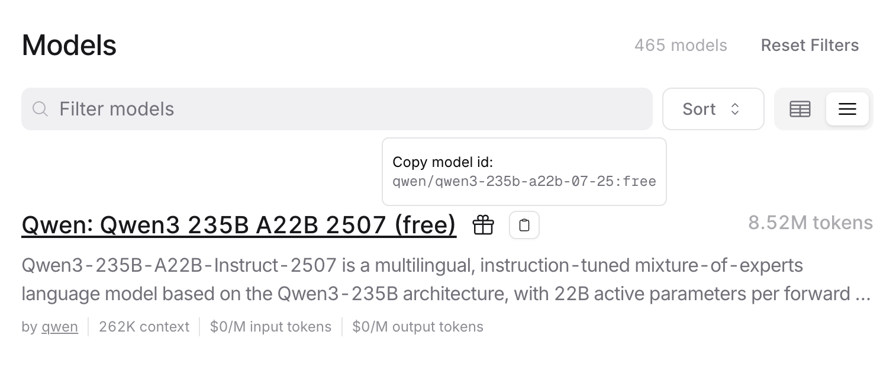

# Switching Models

OpenRouter enables access to over 100 models by simply changing the model ID.

You can head over to the [Models](https://openrouter.ai/models) page to check out the full list. For any model, press the model ID button next to its name. This will copy the model ID into your clipboard, then you can paste the model ID into your code.

<figure><figcaption></figcaption></figure>

#### Multiple Models Example


```rust
use orpheus::prelude::*;

fn main() {
    let client = Orpheus::new("Your-API-Key");
    
    let prompt = "Who are you";
    
    let claude = "anthropic/claude-3.5-haiku";
    let res = client.chat(prompt).model(claude).send().unwrap();
    println!("Claude: {}\n", res.content().unwrap());
    
    let chatgpt = "openai/chatgpt-4o-latest";
    let res = client.chat(prompt).model(chatgpt).send().unwrap();
    println!("ChatGPT: {}\n", res.content().unwrap());
    
    let kimi = "moonshotai/kimi-k2";
    let res = client.chat(prompt).model(kimi).send().unwrap();
    println!("Kimi: {}\n", res.content().unwrap());
}
```


Output:

```
Claude: I'm Claude, an AI created by Anthropic. I aim to be helpful, honest, and harmless. I won't pretend to be human, and I'm always direct about being an AI. I'm happy to help you with tasks or conversation while being clear about my capabilities and limitations.

ChatGPT: I'm ChatGPT, a large language model developed by OpenAI. I'm here to help answer your questions, provide information, brainstorm ideas, and assist with a wide range of tasks—from writing and researching to problem-solving and having conversations. If you’re curious about something or need help, just ask! 😊

Kimi: I'm Kimi, your AI assistant from Moonshot AI. How can I help you today?
```
